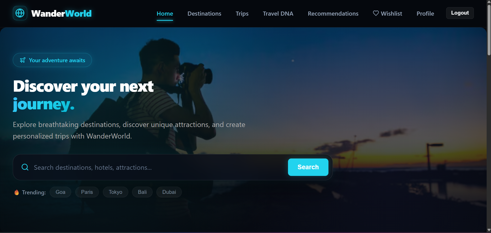
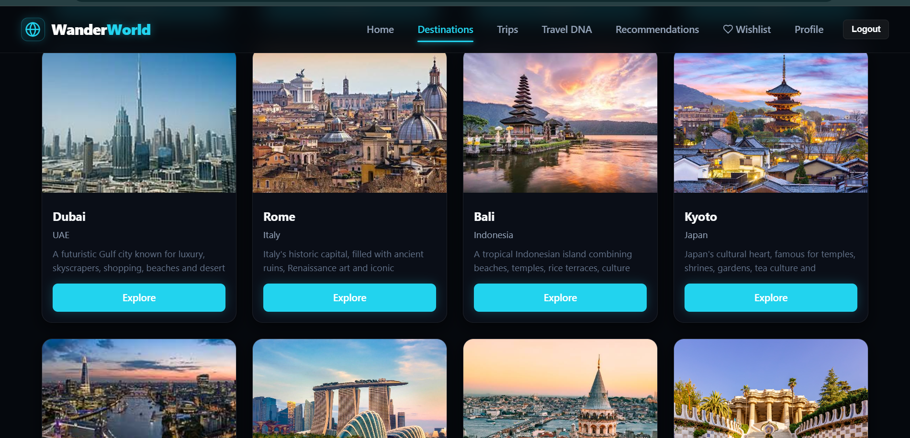
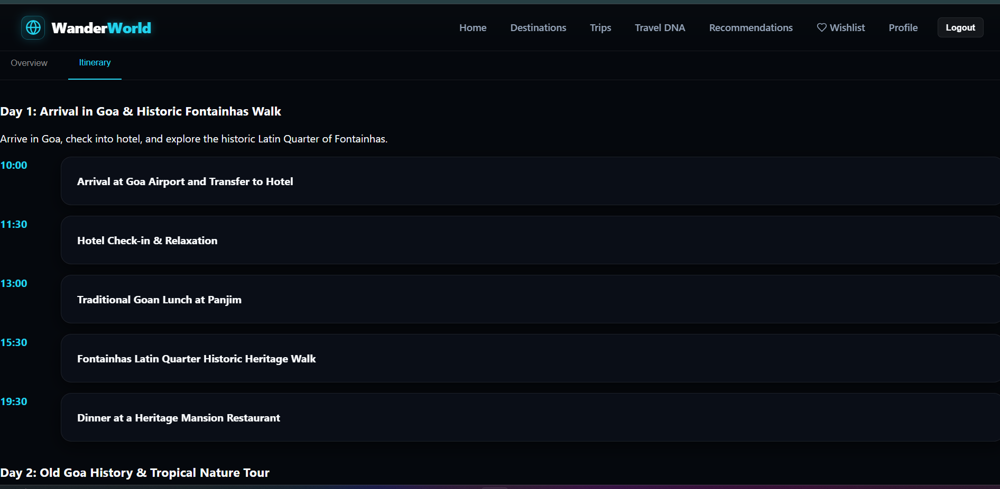
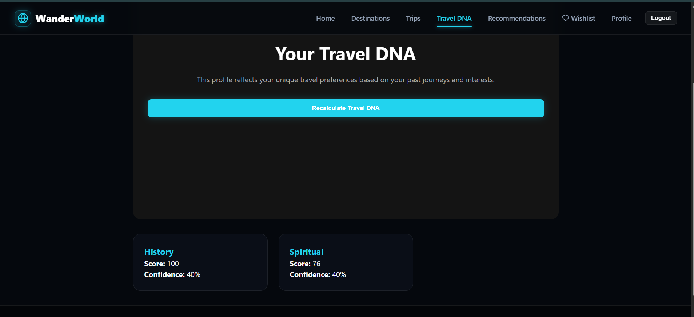
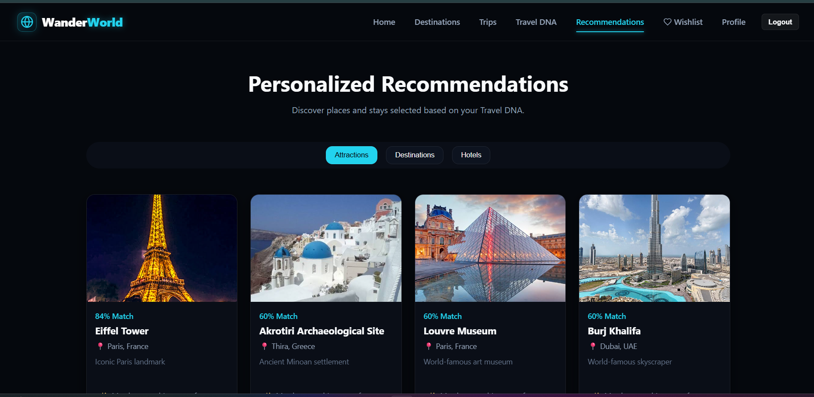
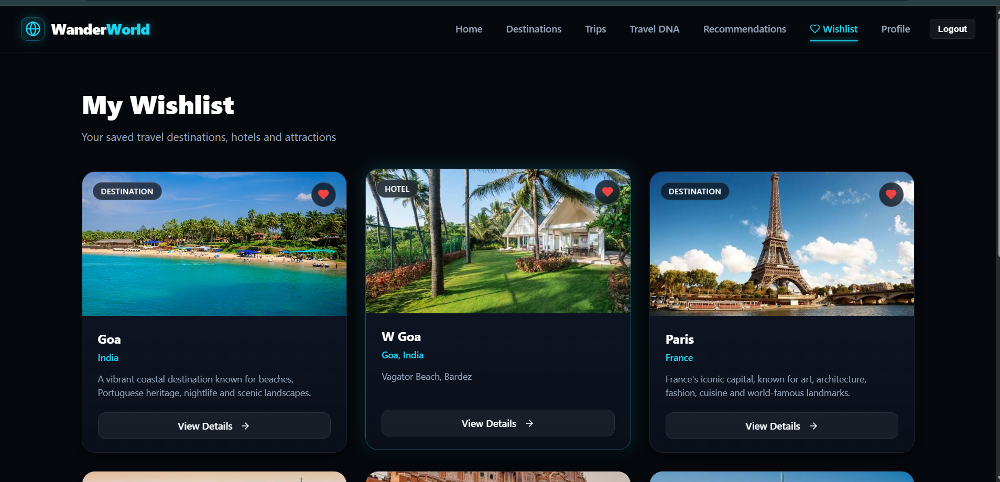

# 🌍 WanderWorld AI

> An AI-powered travel planning and recommendation platform that helps users discover destinations, create personalized trips, and get intelligent travel recommendations.

## 📌 Overview

WanderWorld AI is a full-stack travel platform designed to provide a personalized travel experience.

The application allows users to:

- Explore destinations and attractions
- Discover hotels and travel experiences
- Create personalized trips using AI
- Get travel recommendations based on user preferences
- Maintain a Travel DNA profile
- Save destinations to a wishlist
- Submit and view traveler reviews
- Manage their travel profile

The project combines a modern React frontend with a Django REST backend and PostgreSQL database.

---

## ✨ Features

### 🗺️ Destination Discovery

- Browse available destinations
- Explore attractions and places of interest
- View detailed destination information
- Explore hotels and attractions
- Add places to wishlist

### 🤖 AI Trip Planner

- Generate personalized travel itineraries
- Consider user preferences and trip requirements
- Organize travel plans by day
- Provide personalized recommendations

### 🧬 Travel DNA

Travel DNA builds a profile of the user's travel preferences and interests to improve recommendations.

### ⭐ Reviews

- Authenticated users can submit reviews
- Users can provide ratings and written experiences
- Reviews are stored in the database
- Published reviews are visible to other users
- Reviews are supported for hotels and attractions
- Review lists automatically refresh after submission

### ❤️ Wishlist

- Save favorite destinations and attractions
- View saved places
- Remove places from the wishlist

### 🎯 Recommendations

- Personalized travel recommendations
- Recommendation scoring based on user preferences
- Helps users discover relevant destinations and experiences

### 👤 User Authentication

- User registration and login
- Authentication-protected features
- User profile management
- Personalized user experience

---

## 📸 Screenshots

### 🏠 Home Page



### 🗺️ Destinations



### 🤖 AI Trip Planner



### 🧬 Travel DNA



### 🎯 Recommendations



### ❤️ Wishlist


---

## 🛠️ Tech Stack

### Frontend

- React.js
- JavaScript
- Vite
- HTML5
- CSS3
- Axios

### Backend

- Python
- Django
- Django REST Framework

### Database

- PostgreSQL

### AI

- Generative AI APIs for personalized travel planning and recommendations

### Development Tools

- Git
- GitHub
- VS Code
- Postman

---

## 🏗️ Project Structure

```text
Wanderworld-AI/
│
├── backend/
│   ├── apps/
│   ├── config/
│   ├── manage.py
│   └── requirements.txt
│
├── frontend/
│   ├── src/
│   ├── public/
│   ├── package.json
│   └── vite.config.js
│
├── docs/
│
├── screenshots/
│
├── .env.example
├── .gitignore
└── README.md
