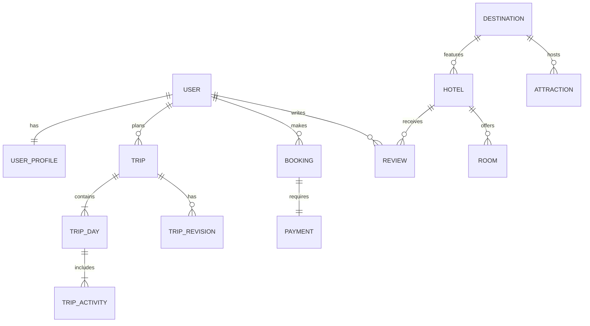

# Database Design: WanderWorld

## 1. Database Overview
WanderWorld utilizes a normalized PostgreSQL database designed for scalability, supporting core travel features and advanced AI-driven personalization (Travel DNA, trip optimization).

## 2. Entity List
- Users, UserProfiles, TravelDNACategories, UserTravelDNA
- Destinations, DestinationImages
- Hotels, HotelImages, Rooms
- Attractions, AttractionImages
- Wishlists, Reviews
- Notifications
- Bookings, Payments
- Trips, TripDays, TripActivities, TripRevisions

## 3. Table-by-Table Design (Highlights)

### Core User Entities
- **Users**: ID (PK), Username, Email (Unique), PasswordHash, CreatedAt, UpdatedAt
- **UserProfiles**: UserID (PK, FK), Bio, AvatarURL, Location
- **TravelDNACategories**: ID (PK), Name, Description
- **UserTravelDNA**: UserID (FK), CategoryID (FK), Score (1-10)

### Travel Catalog
- **Destinations**: ID (PK), Name, Country, Description, Coordinates
- **Hotels**: ID (PK), DestinationID (FK), Name, PricePerNight, Rating
- **Rooms**: ID (PK), HotelID (FK), Type, Price, AvailabilityStatus
- **Attractions**: ID (PK), DestinationID (FK), Name, Type, Rating

### Booking & Payment
- **Bookings**: ID (PK), UserID (FK), RoomID (FK), CheckInDate, CheckOutDate, Amount, Status (Pending, Confirmed, Cancelled)
- **Payments**: ID (PK), BookingID (FK, Unique), GatewayID, Amount, Status, CreatedAt

### Trip Planner
- **Trips**: ID (PK), UserID (FK), Title, StartDate, EndDate, Budget, CurrentRevisionID (FK)
- **TripDays**: ID (PK), TripID (FK), Date, Sequence
- **TripActivities**: ID (PK), DayID (FK), Name, StartTime, EndTime, Cost, Sequence
- **TripRevisions**: ID (PK), TripID (FK), ParentRevisionID (FK), ItinerarySnapshot (JSONB), Reason, CreatedAt

## 4. Relationship Diagram

## 5. Booking & Payment Design
- Bookings and Payments are linked 1:1.
- Statuses are controlled by enum (Pending, Confirmed, Cancelled).
- Payments link directly to BookingID and store Gateway metadata.

## 6. Travel DNA Design
- Managed via `TravelDNACategories` (master) and `UserTravelDNA` (Many-to-Many).

## 7. AI Trip Planner & Re-Optimizer
- Hierarchy: Trip -> Day -> Activity.
- `TripRevisions` stores snapshots (`JSONB`) to track itinerary history efficiently.

## 8. Budget Intelligence
- Total budget (stored). Costs (dynamic) from Activities + Bookings.

## 9. Recommendation Design
- Recommendation scores are dynamic/cached. History is stored in `RecommendationHistory` if needed (e.g., to improve future AI prompts).

## 10. Notification Design
- Fields: `UserID`, `Type`, `Title`, `Message`, `IsRead`, `CreatedAt`.

## 11. Indexing Strategy
- Indexes on `Users(Email)`, `Destinations(Name, Location)`, `Hotels(Price, Rating)`, `Bookings(Status, CheckInDate)`, `Trips(UserID)`.

## 12. Security & Data Integrity
- Passwords hashed; no secrets/sensitive payment data stored.
- `NOT NULL`, `UNIQUE`, `CHECK` constraints applied. `ON DELETE CASCADE` used appropriately.

## 13. Scalability
- JSONB for flexible AI metadata. Partitioning planned for `Notifications`.
